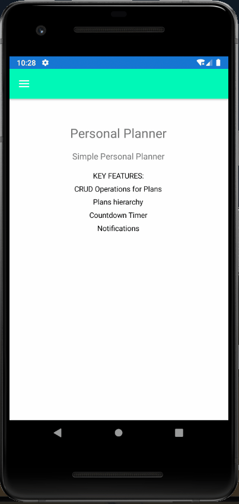
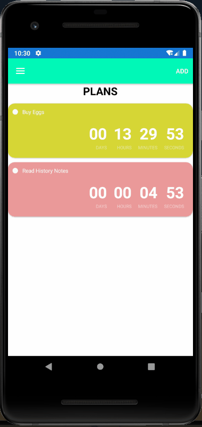
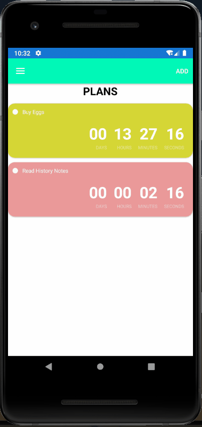
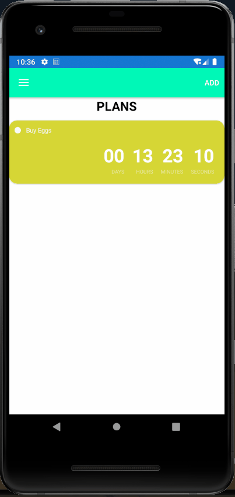
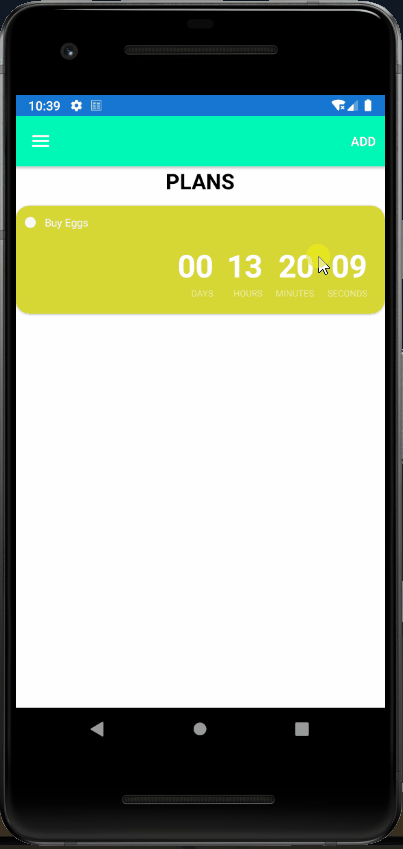
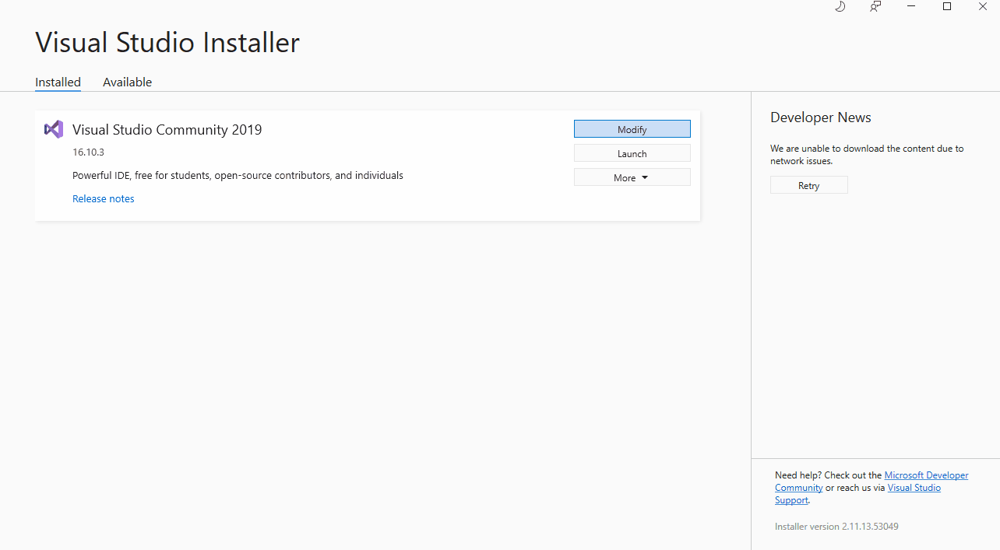
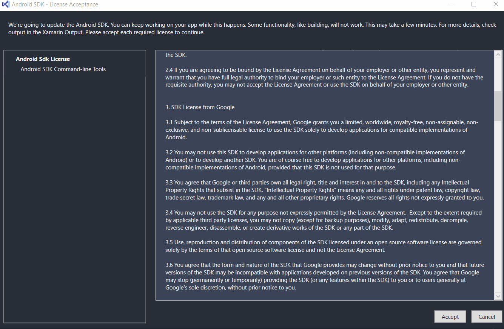
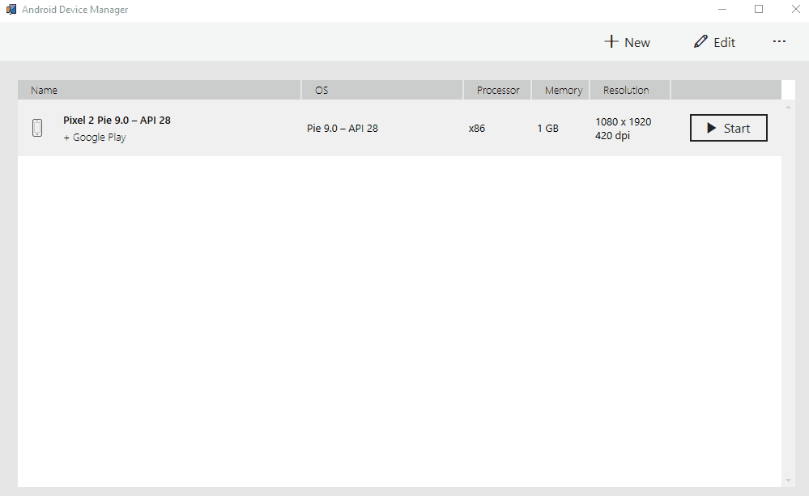

# Android Personal Planner App | Xamarin Forms

## Table of contents
* [Showcase](#showcase)
  * [Home Screen & Adding Plans](#home-screen-and-adding-a-plan)
  * [Plans hierarchy & Notifications](#plans-hierarchy-and-notifications)
  * [Completed Plans & Edit Plan](#completed-plans-and-edit-plan)
* [Getting Started](#getting-started)
* [Run Application](#run-application)
* [Download APK](#download-apk)

## Showcase

### Home Screen And Adding a Plan

### Plans hierarchy And Notifications

### Completed Plans And Edit Plan



## Getting Started

```bash
Install Visual Studio 2019 or Later

Install Xamarin Forms
```


```bash
git clone https://github.com/Codzaa/XamarinPlannerApp.git

cd XamarinPlannerApp

```
```bash
Install Android sdk
```

```bash
Install Emulator or Plug in Android Phone
```


### Run Application
```bash
Build Application

Start Application
```
### Download APK

1. You can download Apk which is located in the Apk Folder.
